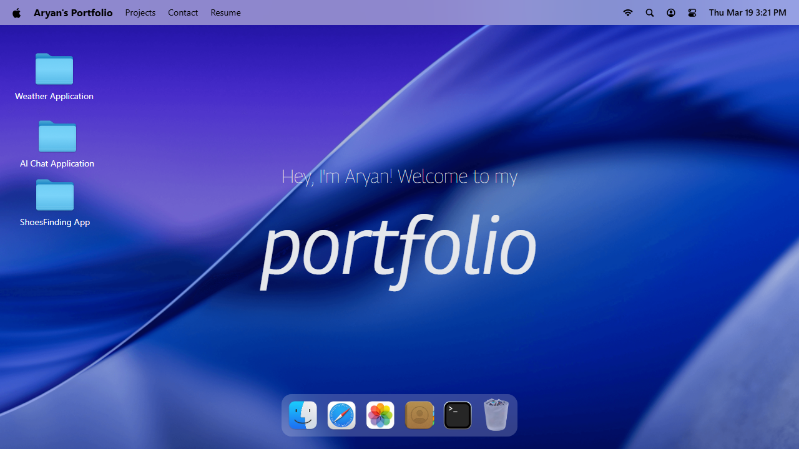
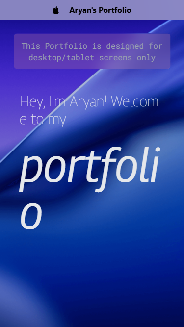

# macOS Web Portfolio 🍏

A stunning, interactive personal portfolio website inspired by the macOS operating system. Built with React, Vite, and Tailwind CSS.



## 🌟 Features

- **macOS Desktop Experience**: A fully interactive desktop environment that feels just like macOS.
- **Window Management**: Open, close, minimize, and drag windows around the screen (powered by custom hooks and GSAP).
- **Custom Apps**: Includes beautifully designed apps like Finder, Terminal, Safari, and Photos to showcase your work and skills.
- **Responsive Design**: Works seamlessly across desktop and mobile devices.
- **Dock**: A functional macOS-style dock with smooth animations and interactive hover effects.
- **Interactive Elements**: Features dynamic components with subtle micro-animations for an enhanced user experience.

## 📱 Mobile Experience

The portfolio is fully responsive, ensuring a seamless experience on mobile devices as well.



## 🚀 Quick Start

### Prerequisites

- [Node.js](https://nodejs.org/) installed
- npm or yarn

### Installation Steps

1. Clone the repository
   ```bash
   git clone https://github.com/yourusername/macos-portfolio.git
   cd macos-portfolio
   ```

2. Install dependencies
   ```bash
   npm install
   ```

3. Start the development server
   ```bash
   npm run dev
   ```

4. Open your browser and navigate to `http://localhost:5173/`

## 🛠️ Built With

- **[React](https://reactjs.org/)** - UI Library (v19)
- **[Vite](https://vitejs.dev/)** - Next Generation Frontend Tooling
- **[Tailwind CSS](https://tailwindcss.com/)** - Utility-first CSS framework (v4)
- **[GSAP](https://greensock.com/gsap/)** - Professional-grade animation library
- **[Zustand](https://github.com/pmndrs/zustand)** - A small, fast, and scalable bearbones state-management solution
- **[Lucide React](https://lucide.dev/)** - Beautiful & consistent icons

## 🎨 Customization

You can easily customize this portfolio to make it your own:

- **Apps**: Modify or add new applications inside the `src/components` directory.
- **Assets**: Replace images in the `public/images` directory with your own assets.
- **Content**: Update the generic content in files like `Welcome.jsx`, `Terminal.jsx`, and `Photos.jsx` with your personal details and projects.
- **Styles**: Tweak global colors and design tokens in `src/index.css`.

## 📄 License

This project is open-source and available under the [MIT License](LICENSE).
